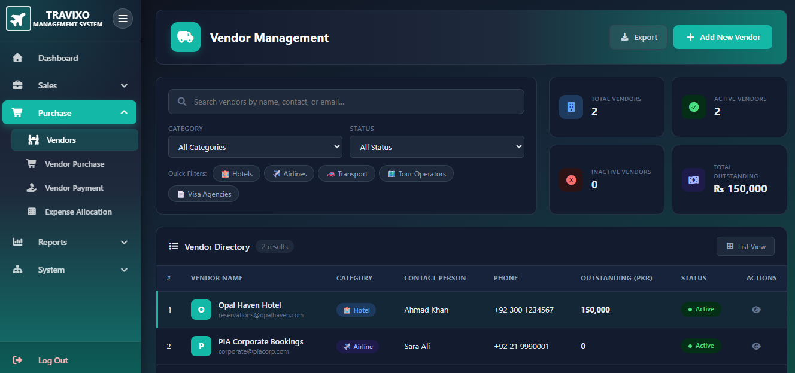
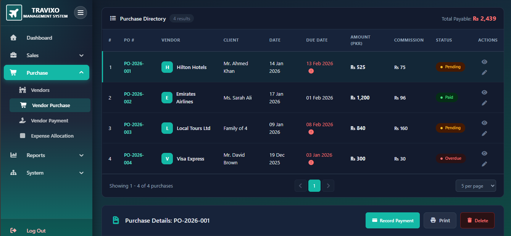

# Travixo 🌍

A modern travel platform built with Angular that helps users search, compare, and book travel options with a clean, responsive interface.


---

## 📸 Screenshots

### Home


### Search


### Results


### Login


---

## ✨ Features

- 🔍 [Search flights / hotels / packages]
- 📊 Compare results in real time
- 🔐 User authentication
- 📱 Fully responsive design
- ⚡ Fast and modern UI
- 🌐 [Any other key feature]

---

## 🛠️ Tech Stack

| Technology | Purpose |
|---|---|
| Angular | Frontend framework |
| TypeScript | Programming language |
| RxJS | Reactive state management |
| [Node/Express] | Proxy server for external APIs |
| SCSS / CSS | Styling |

---

## 🚀 Getting Started

### Prerequisites
- Node.js (v18+)
- npm
- Angular CLI (`npm install -g @angular/cli`)

### Installation

```bash
git clone https://github.com/zaibi137/travixo.git
cd travixo
npm install